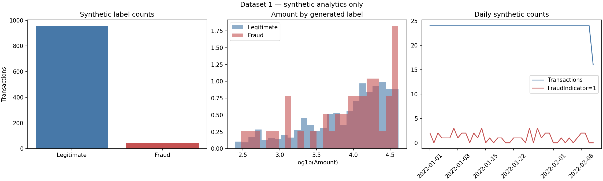

# Dataset 1 EDA — Synthetic Financial Fraud Dataset

> **Synthetic data notice:** fraud and suspicious indicators are randomly generated. These results do not represent real financial behavior or causal relationships.

## Data profile

- Transactions: 1,000; analytical columns: 12
- Join row-count check: 1,000 input → 1,000 output
- FraudIndicator: 45 positive / 955 legitimate (4.50% positive)
- Missing values: 0; exact duplicate rows: 0
- Timestamp span: 2022-01-01 00:00:00 to 2022-02-11 15:00:00; unparsed timestamps: 0

## Amounts by generated target

`Amount` and `TransactionAmount` are separately generated fields and are summarized independently.

| Field | Target | Count | Mean | Median | 95th percentile | Maximum |
|---|---:|---:|---:|---:|---:|---:|
| Amount | 0 | 955 | 55.3153 | 57.4562 | 94.9199 | 99.8874 |
| Amount | 1 | 45 | 57.0832 | 58.8818 | 96.1400 | 99.2433 |
| TransactionAmount | 0 | 955 | 56.0432 | 56.2539 | 96.5868 | 99.7843 |
| TransactionAmount | 1 | 45 | 51.8341 | 51.1389 | 86.3401 | 93.9098 |

## Fraud counts by category

| Category | Transactions | FraudIndicator=1 | Synthetic positive rate |
|---|---:|---:|---:|
| Food | 204 | 9 | 4.41% |
| Online | 196 | 10 | 5.10% |
| Other | 210 | 10 | 4.76% |
| Retail | 192 | 9 | 4.69% |
| Travel | 198 | 7 | 3.54% |

## Time overview

Daily bins with parseable timestamps: 42.
The plotted daily counts are descriptive only; this synthetic label was sampled independently of transaction behavior.

## Limitations

The result is suitable for integration and analytics demonstrations only. Fraud rates and category/time patterns are synthetic observations, not financial-industry estimates. Customer name, address, age, account-balance, and login-time fields were excluded from the analytical table.
