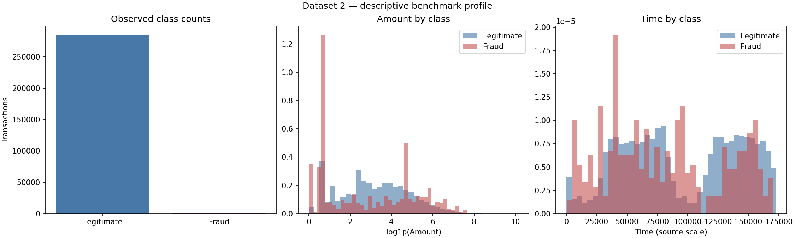
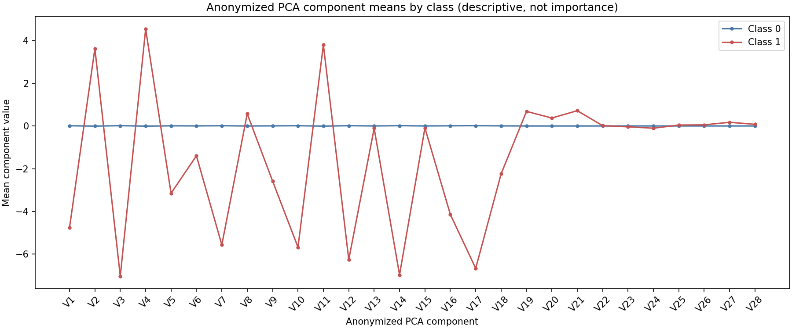

# Dataset 2 EDA — Credit Card Fraud Dataset

## Data profile

- Transactions: 284,807; columns: 31
- Class 1 fraud: 492; Class 0 legitimate: 284,315
- Positive rate: 0.1727%; class imbalance (legitimate:fraud): 577.9:1
- Missing values: 0; exact duplicate rows: 1,081 (preserved)
- Loader encoding: utf-8-sig

## Amount by class

Amount is reported in the dataset's source units; no currency assumption is added.

| Class | Count | Mean | Median | 95th percentile | Maximum |
|---:|---:|---:|---:|---:|---:|
| 0 | 284315 | 88.2910 | 22.0000 | 364.4090 | 25,691.1600 |
| 1 | 492 | 122.2113 | 9.2500 | 640.9050 | 2,125.8700 |

## Time field by class

`Time` is summarized in the source's numeric scale and is not converted to calendar timestamps.

| Class | Count | Mean | Median | 95th percentile | Maximum |
|---:|---:|---:|---:|---:|---:|
| 0 | 284315 | 94,838.2023 | 84,711.0000 | 164,149.3000 | 172,792.0000 |
| 1 | 492 | 80,746.8069 | 75,568.5000 | 156,696.2500 | 170,348.0000 |

## V1–V28 PCA component summaries

V1–V28 are anonymized PCA components. Their names have no disclosed business interpretation; class-wise means below are descriptive summaries, not feature importance or causal effects.

| Component | Class 0 mean | Class 1 mean | Class 0 std | Class 1 std |
|---|---:|---:|---:|---:|
| V1 | 0.0083 | -4.7719 | 1.9298 | 6.7837 |
| V2 | -0.0063 | 3.6238 | 1.6361 | 4.2912 |
| V3 | 0.0122 | -7.0333 | 1.4594 | 7.1109 |
| V4 | -0.0079 | 4.5420 | 1.3993 | 2.8733 |
| V5 | 0.0055 | -3.1512 | 1.3570 | 5.3725 |
| V6 | 0.0024 | -1.3977 | 1.3299 | 1.8581 |
| V7 | 0.0096 | -5.5687 | 1.1788 | 7.2068 |
| V8 | -0.0010 | 0.5706 | 1.1613 | 6.7978 |
| V9 | 0.0045 | -2.5811 | 1.0894 | 2.5009 |
| V10 | 0.0098 | -5.6769 | 1.0442 | 4.8973 |
| V11 | -0.0066 | 3.8002 | 1.0031 | 2.6786 |
| V12 | 0.0108 | -6.2594 | 0.9459 | 4.6545 |
| V13 | 0.0002 | -0.1093 | 0.9951 | 1.1045 |
| V14 | 0.0121 | -6.9717 | 0.8970 | 4.2789 |
| V15 | 0.0002 | -0.0929 | 0.9151 | 1.0499 |
| V16 | 0.0072 | -4.1399 | 0.8448 | 3.8650 |
| V17 | 0.0115 | -6.6658 | 0.7495 | 6.9706 |
| V18 | 0.0039 | -2.2463 | 0.8249 | 2.8994 |
| V19 | -0.0012 | 0.6807 | 0.8117 | 1.5399 |
| V20 | -0.0006 | 0.3723 | 0.7694 | 1.3466 |
| V21 | -0.0012 | 0.7136 | 0.7167 | 3.8693 |
| V22 | -0.0000 | 0.0140 | 0.7237 | 1.4946 |
| V23 | 0.0001 | -0.0403 | 0.6215 | 1.5796 |
| V24 | 0.0002 | -0.1051 | 0.6058 | 0.5156 |
| V25 | -0.0001 | 0.0414 | 0.5207 | 0.7972 |
| V26 | -0.0001 | 0.0516 | 0.4822 | 0.4717 |
| V27 | -0.0003 | 0.1706 | 0.3998 | 1.3768 |
| V28 | -0.0001 | 0.0757 | 0.3296 | 0.5473 |

## Limitations

These are descriptive benchmark-dataset statistics only. No model has been fitted, no threshold selected, and no fraud effectiveness claimed. Exact duplicate rows are retained; downstream data preparation must decide and document their treatment.
