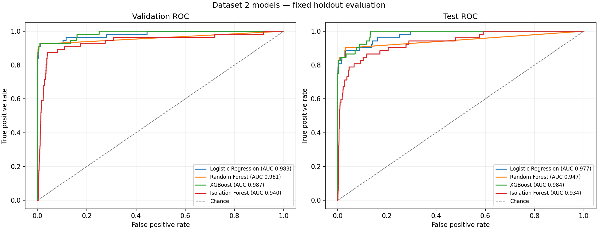
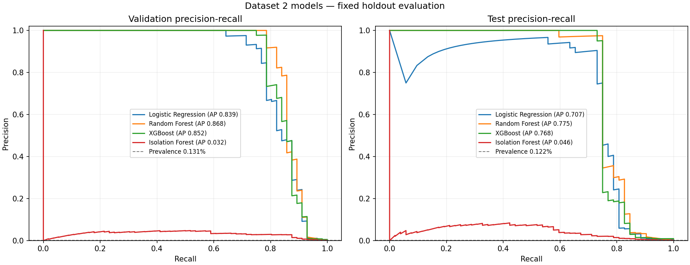
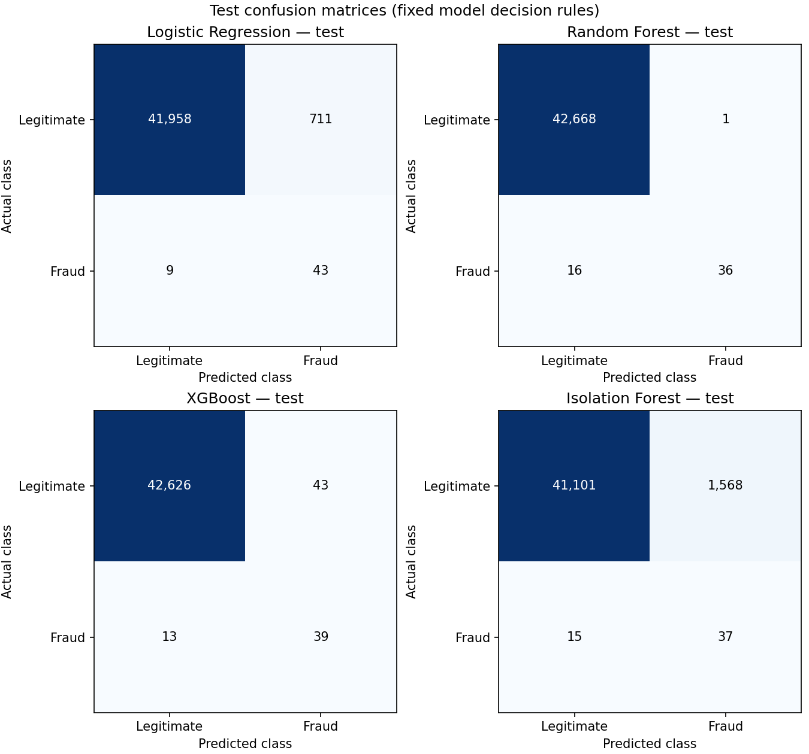

# Dataset 2 Model Evaluation

All estimators were fitted before this evaluation. The utility did not refit models, tune thresholds, or select a winner.

- Target: `Class` (fraud class 1)
- Split: chronological 70/15/15 by row count; equal Time values kept together; no shuffling
- Dataset 1 is synthetic and is not combined with Dataset 2 model metrics.
- PR-AUC is average precision. Precision/recall/F1 and confusion counts use each model's stated fixed decision rule.

## Validation results

| Model | Score type | Decision rule | Prevalence | Alert rate | Precision | Recall | F1 | ROC-AUC | PR-AUC | TN | FP | FN | TP |
|---|---|---|---:|---:|---:|---:|---:|---:|---:|---:|---:|---:|---:|
| Logistic Regression | probability | probability >= 0.5 (fixed) | 0.1311% | 2.2962% | 0.053007 | 0.928571 | 0.100289 | 0.982762 | 0.839355 | 41,737 | 929 | 4 | 52 |
| Random Forest | probability | probability >= 0.5 (fixed) | 0.1311% | 0.0936% | 1.000000 | 0.714286 | 0.833333 | 0.961397 | 0.868153 | 42,666 | 0 | 16 | 40 |
| XGBoost | probability | probability >= 0.5 (fixed) | 0.1311% | 0.2060% | 0.545455 | 0.857143 | 0.666667 | 0.987024 | 0.851849 | 42,626 | 40 | 8 | 48 |
| Isolation Forest | anomaly | Isolation Forest native predict cutoff (contamination=auto) | 0.1311% | 5.1238% | 0.022385 | 0.875000 | 0.043653 | 0.939653 | 0.032430 | 40,526 | 2,140 | 7 | 49 |

## Test results

| Model | Score type | Decision rule | Prevalence | Alert rate | Precision | Recall | F1 | ROC-AUC | PR-AUC | TN | FP | FN | TP |
|---|---|---|---:|---:|---:|---:|---:|---:|---:|---:|---:|---:|---:|
| Logistic Regression | probability | probability >= 0.5 (fixed) | 0.1217% | 1.7649% | 0.057029 | 0.826923 | 0.106700 | 0.977236 | 0.706915 | 41,958 | 711 | 9 | 43 |
| Random Forest | probability | probability >= 0.5 (fixed) | 0.1217% | 0.0866% | 0.972973 | 0.692308 | 0.808989 | 0.946956 | 0.775480 | 42,668 | 1 | 16 | 36 |
| XGBoost | probability | probability >= 0.5 (fixed) | 0.1217% | 0.1919% | 0.475610 | 0.750000 | 0.582090 | 0.984437 | 0.768073 | 42,626 | 43 | 13 | 39 |
| Isolation Forest | anomaly | Isolation Forest native predict cutoff (contamination=auto) | 0.1217% | 3.7569% | 0.023053 | 0.711538 | 0.044659 | 0.933870 | 0.046077 | 41,101 | 1,568 | 15 | 37 |

## Interpretation limits

These values describe the single observed chronological dataset snapshot. A model may rank cases well while its fixed cutoff produces an unsuitable alert rate. Isolation Forest's anomaly scores are not fraud probabilities, and its outlier decision uses `contamination=auto`; do not compare that operating rule to probability thresholds as if they were equivalent. No test-derived threshold or model selection decision is made here. The final test partition remains an evaluation set, not a tuning set.
